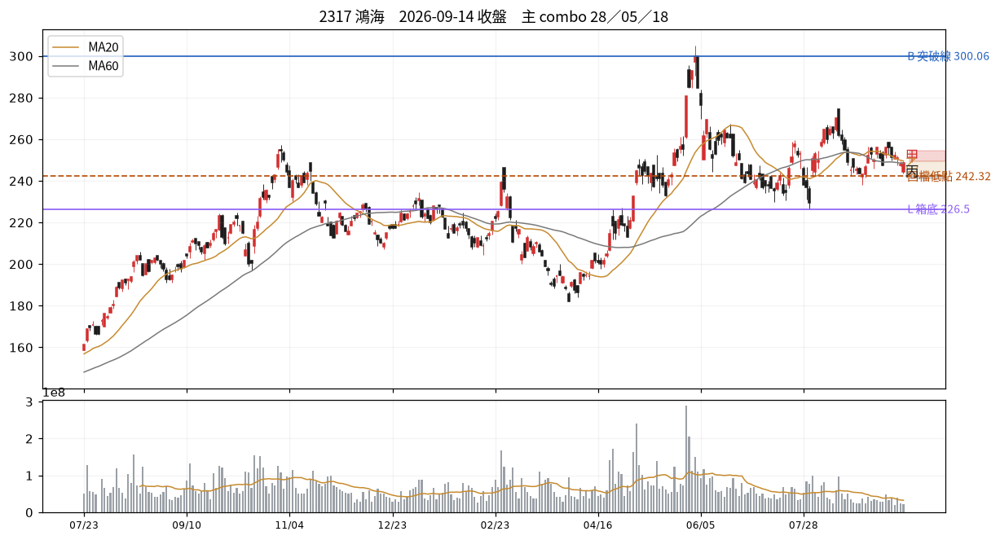

# 2317 鴻海　2026-09-14 收盤後

## 12 項指標
| # | 欄位 | 原值 | 同日分位 | 手冊線 |
|---|---|---|---|---|
| C01 | 壓縮 15d % | 8.45 | P38 | 2.5→P0；3.0→P1；3.5→P1 |
| C02 | 前高測試次數 | 0.00 | P31 | 3→P66；5→P79；6→P85 |
| C03 | 收盤品質 | 0.83 | P79 | 0.4→P50；0.7→P73；0.85→P84 |
| C04 | 洗盤破底深度 % | 缺值 | — |  |
| C05 | 突破量比 | 0.66 | P53 | 1.2→P64；1.5→P74；3.0→P91 |
| C06 | RS 超額（百分點） | 0.90 | P68 | 0.0→P52；2.0→P79 |
| C07 | 推進效率 ER | 0.11 | P32 | 0.15→P36；0.4→P81 |
| C08 | 250d 突破次數 | 4.00 | P78 | 1→P32；3→P55；4→P66 |
| C09 | 事件反應超額 | 缺值 | — |  |
| C10 | 三日 MAE %（T 時禁用） | 缺值 | — |  |
| C11 | 壓力修復根數（-1=未收復） | 3.00 | — |  |
| C12 | 距最近新高日數 | 71.00 | P35 | 15→P28；30→P38 |

## 關鍵價位
| 項目 | 值 |
|---|---|
| 收盤 | 248.50 |
| 突破線 B | 300.06 |
| 箱底 L | 226.50 |
| 最近回檔低點 | 242.32 |
| MA20 | 249.57 |
| ATR(14) | 6.18 → 明日常態區 242.32~254.68 |

## 明日三分支
| 分支 | 條件 | 空手 | 持有 |
|---|---|---|---|
| 甲 | 收 > 249.5（前一日高） | 掛突破買 @249.75 | 續抱，停損上移至 @242.32 |
| 乙 | 收 242.32~249.5 | 不動觀察 | 續抱，停損維持 @249.57 |
| 丙 | 收 < 242.32（收盤-1ATR） | 移出名單 | 出場或減半 @242.32 |

**作廢條件**：開盤跳空超出 ±9.27 → 全部分支失效，當日重算

## 命中的 combo
### 28 快速修復但尚未突破　（E 類）— 修復完成
| 條件 | 實際值 | |
|---|---|---|
| `c11_bars_recover>=0` | c11_bars_recover=3.00 | ✓ |
| `c11_bars_recover<=T.recover_fast` | c11_bars_recover=3.00 | ✓ |
| `not below_L` | below_L=否 | ✓ |
| `not above_B` | above_B=否 | ✓ |

- 接著確認｜下一關是前高 B，而非反覆把已修復的長黑當利多
- 改判／失效｜跌回壓力日高點下方並失守最近回檔低點

### 05 底部初測、壓縮未完成　（A 類）— 方向待定
| 條件 | 實際值 | |
|---|---|---|
| `c02_tests<=1` | c02_tests=0.00 | ✓ |
| `c01_tight>T.tight_compress` | c01_tight=8.45 | ✓ |
| `c05_contract>T.vol_contract` | c05_contract=0.89 | ✓ |
| `not above_B` | above_B=否 | ✓ |

- 接著確認｜等新的整理資料形成，看低點與振幅是否改善
- 改判／失效｜直接收盤突破且量價配合，轉入突破當日評估

### 18 低效率但箱底穩定　（C 類）— 橫盤結構
| 條件 | 實際值 | |
|---|---|---|
| `c07_er<=T.er_low` | c07_er=0.11 | ✓ |
| `not below_L` | below_L=否 | ✓ |
| `not shake_broken` | shake_broken=否 | ✓ |
| `abs(c06_rs)<T.rs_lead` | c06_rs=0.90 | ✓ |

- 接著確認｜哪一側先以收盤突破，並檢查後續是否維持
- 改判／失效｜向上或向下離開箱體並獲後續確認

### 47 均線失守、低點尚未破　（H 類）— 局部轉弱
| 條件 | 實際值 | |
|---|---|---|
| `close<ma20` | ma20=249.57、close=248.50 | ✓ |
| `close>recent_swing_low` | recent_swing_low=238.00、close=248.50 | ✓ |
| `c06_rs>0` | c06_rs=0.90 | ✓ |

- 接著確認｜能否收復 MA20，或進一步跌破最近回檔低點
- 改判／失效｜收復且推進則改善；破低且 RS 轉負則轉弱擴大

## 資料狀態
COMPLETE — 全部欄位可用

## 事件
無 event log 紀錄。F／I 類 combo 全部 UNAVAILABLE。

---
_本卡為狀態描述，無勝率估計。動作皆附價位；未附價位者代表定義未凍結，已略去。_