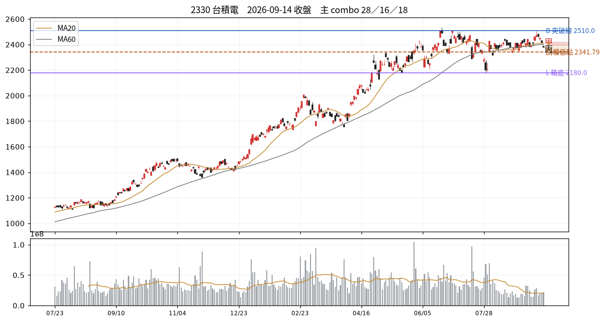

# 2330 台積電　2026-09-14 收盤後

## 12 項指標
| # | 欄位 | 原值 | 同日分位 | 手冊線 |
|---|---|---|---|---|
| C01 | 壓縮 15d % | 6.51 | P26 | 2.5→P0；3.0→P1；3.5→P1 |
| C02 | 前高測試次數 | 5.00 | P92 | 3→P66；5→P79；6→P85 |
| C03 | 收盤品質 | 0.00 | P6 | 0.4→P50；0.7→P73；0.85→P84 |
| C04 | 洗盤破底深度 % | 缺值 | — |  |
| C05 | 突破量比 | 1.06 | P80 | 1.2→P64；1.5→P74；3.0→P91 |
| C06 | RS 超額（百分點） | -0.55 | P21 | 0.0→P52；2.0→P79 |
| C07 | 推進效率 ER | 0.04 | P13 | 0.15→P36；0.4→P81 |
| C08 | 250d 突破次數 | 11.00 | P98 | 1→P32；3→P55；4→P66 |
| C09 | 事件反應超額 | 缺值 | — |  |
| C10 | 三日 MAE %（T 時禁用） | 缺值 | — |  |
| C11 | 壓力修復根數（-1=未收復） | 2.00 | — |  |
| C12 | 距最近新高日數 | 59.00 | P28 | 15→P28；30→P38 |

## 關鍵價位
| 項目 | 值 |
|---|---|
| 收盤 | 2380.00 |
| 突破線 B | 2510.00 |
| 箱底 L | 2180.00 |
| 最近回檔低點 | 2341.79 |
| MA20 | 2410.00 |
| ATR(14) | 38.21 → 明日常態區 2341.79~2418.21 |

## 明日三分支
| 分支 | 條件 | 空手 | 持有 |
|---|---|---|---|
| 甲 | 收 > 2395.0（前一日高） | 掛突破買 @2397.39 | 續抱，停損上移至 @2341.79 |
| 乙 | 收 2341.79~2395.0 | 不動觀察 | 續抱，停損維持 @2410.0 |
| 丙 | 收 < 2341.79（收盤-1ATR） | 移出名單 | 出場或減半 @2341.79 |

**作廢條件**：開盤跳空超出 ±57.32 → 全部分支失效，當日重算

## 命中的 combo
### 28 快速修復但尚未突破　（E 類）— 修復完成
| 條件 | 實際值 | |
|---|---|---|
| `c11_bars_recover>=0` | c11_bars_recover=2.00 | ✓ |
| `c11_bars_recover<=T.recover_fast` | c11_bars_recover=2.00 | ✓ |
| `not below_L` | below_L=否 | ✓ |
| `not above_B` | above_B=否 | ✓ |

- 接著確認｜下一關是前高 B，而非反覆把已修復的長黑當利多
- 改判／失效｜跌回壓力日高點下方並失守最近回檔低點

### 16 高齡加上推進受阻　（C 類）— 轉弱疑慮
| 條件 | 實際值 | |
|---|---|---|
| `(c08_bo_count>=T.bo_count_aged) or (c08_gain_from_low>T.gain_from_low_aged)` | c08_gain_from_low=110.63、c08_bo_count=11.00 | ✓ |
| `c07_er<=T.er_low` | c07_er=0.04 | ✓ |
| `c06_rs<0` | c06_rs=-0.55 | ✓ |

- 接著確認｜最近支撐是否失守，反彈能否重新領先大盤
- 改判／失效｜重新向上推進、效率改善且 RS 回正

### 18 低效率但箱底穩定　（C 類）— 橫盤結構
| 條件 | 實際值 | |
|---|---|---|
| `c07_er<=T.er_low` | c07_er=0.04 | ✓ |
| `not below_L` | below_L=否 | ✓ |
| `not shake_broken` | shake_broken=否 | ✓ |
| `abs(c06_rs)<T.rs_lead` | c06_rs=-0.55 | ✓ |

- 接著確認｜哪一側先以收盤突破，並檢查後續是否維持
- 改判／失效｜向上或向下離開箱體並獲後續確認

### 45 久未創高且同步落後　（H 類）— 轉弱疑慮
| 條件 | 實際值 | |
|---|---|---|
| `c12_days_since_high>T.newhigh_gap_mid` | c12_days_since_high=59.00 | ✓ |
| `not higher_highs` | higher_highs=否 | ✓ |
| `c06_rs<0` | c06_rs=-0.55 | ✓ |
| `not higher_lows` | higher_lows=否 | ✓ |

- 接著確認｜既定支撐是否失守，反彈是否仍無法過前高
- 改判／失效｜重新創高且低點墊高、RS 回正

## 資料狀態
COMPLETE — 全部欄位可用

## 事件
無 event log 紀錄。F／I 類 combo 全部 UNAVAILABLE。

---
_本卡為狀態描述，無勝率估計。動作皆附價位；未附價位者代表定義未凍結，已略去。_