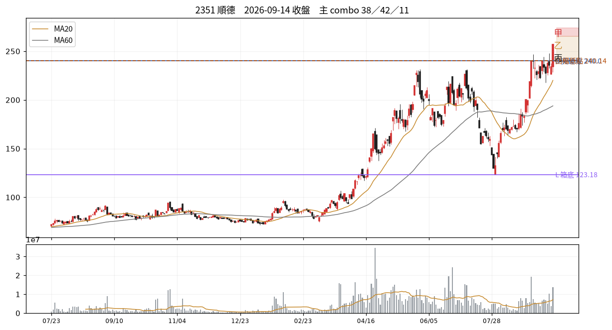

# 2351 順德　2026-09-14 收盤後

## 12 項指標（欄名同速查手冊）
| # | 概念 | 手冊欄位 | 原值 | 同日分位 | 手冊線→實際百分位 |
|---|---|---|---|---|---|
| C01 | 壓縮整理 | `tightness_15d_pct` | 27.24 | P92 | 2.5→P0；3.0→P1；3.5→P1 |
| C02 | 阻力消耗 | `prior_high_tests_count` | 5.00 | P92 | 3→P66；5→P79；6→P85 |
| C03 | 突破推力 | `close_quality` | 1.00 | P94 | 0.4→P50；0.7→P73；0.85→P84 |
| C04 | 結構防守 | `shakeout_depth_pct` | 缺值 | — |  |
| C05 | 量價換手 | `high_zone_turnover_share_20d` ⛔停用 | 缺值 | — |  |
| C06 | 相對強弱 | `rs_excess_taiex_pct` | 10.53 | P99 | 0.0→P52；2.0→P79 |
| C07 | 推進效率 | `price_progress_efficiency_20d` | 0.53 | P95 | 0.15→P36；0.4→P81 |
| C08 | 趨勢年齡 | `major_breakout_count_250d` | 7.00 | P92 | 1→P32；3→P55；4→P66 |
| C09 | 資訊反應 | `resilience_excess_ret` ⛔需事件/T+3 | 缺值 | — |  |
| C10 | 事後認可 | `mfe_mae_ratio_3d` ⛔需事件/T+3 | 缺值 | — |  |
| C11 | 壓力修復 | `bars_to_recover_largest_down_day` | 4.00 | — |  |
| C12 | 動能老化 | `efficiency_decay` | 0.35 | — |  |

| 配套欄位 | 名稱 | 原值 | 同日分位 |
|---|---|---|---|
| C01 配套 | base_depth_pct | 63.55 | P93 |
| C05 配套 | 突破量比 | 2.12 | P94 |
| C05 配套 | 量縮比 | 1.11 | P73 |
| C06 配套 | 20 日 RS 超額 | 51.17 | P99 |
| C08 配套 | 自底漲幅 % | 258.81 | P95 |
| C12 配套 | 距最近新高日數 | 0.00 | P1 |

## 關鍵價位
| 項目 | 值 |
|---|---|
| 收盤 | 257.00 |
| 突破線 B | 240.00 |
| 箱底 L | 123.18 |
| 最近回檔低點 | 240.14 |
| MA20 | 220.05 |
| ATR(14) | 16.86 → 明日常態區 240.14~273.86 |

## 明日三分支
| 分支 | 條件 | 空手 | 持有 |
|---|---|---|---|
| 甲 | 收 > 265.43（收盤+0.5ATR） | 掛突破買 @265.7 | 續抱，停損上移至 @240.14 |
| 乙 | 收 240.14~265.43 | 不動觀察 | 續抱，停損維持 @220.05 |
| 丙 | 收 < 240.14（收盤-1ATR） | 移出名單 | 出場或減半 @240.14 |

**作廢條件**：開盤跳空超出 ±25.29 → 全部分支失效，當日重算

## 這個狀態之後，歷史上最常變成什麼
_主狀態 38 的 episode 結束後，下一段是什麼。2021 年起全市場統計，不是預測。_

| 下一個狀態 | 占比 |
|---|---|
| 28 快速修復但尚未突破 | 28.5% |
| 09 大量成交、收在低處 | 7.2% |
| 62 陰跌未破底 | 6.7% |

依方向彙總：多 50.6%、中性 30.4%、空 18.9%

## 綜合判讀
主狀態是 **38 盤中破線、收盤收回**（測試／待定）。

另有 4 組同時成立——注意手冊 combo 56 的提醒：收高、量大、RS 正這類欄位可能只是在重複描述同一天，不是幾張獨立選票。

下一步確認：後續收盤是否持續在線上並離開 B　／　失效條件：後續收盤跌回箱內且無法收回

## 命中的 combo
### 38 盤中破線、收盤收回　（G 類）— 測試／待定
| 條件 | 實際值 | |
|---|---|---|
| `above_B` | above_B=是 | ✓ |
| `low<B` | low=228.50、B=240.00 | ✓ |
| `not lower_lows` | lower_lows=否 | ✓ |

- 接著確認｜後續收盤是否持續在線上並離開 B
- 改判／失效｜後續收盤跌回箱內且無法收回

### 42 第一次受挫後再突破　（G 類）— 再突破待驗
| 條件 | 實際值 | |
|---|---|---|
| `above_B` | above_B=是 | ✓ |
| `had_failed_breakout` | had_failed_breakout=是 | ✓ |
| `c03_cq>=T.cq_high` | c03_cq=1.00 | ✓ |
| `c05_volratio>=T.vol_ratio_up` | c05_volratio=2.12 | ✓ |

- 接著確認｜以新事件時點追蹤接受，保留舊失守紀錄
- 改判／失效｜再次跌回箱內

### 11 寬幅整理後急拉　（B 類）— 偏多但震盪
| 條件 | 實際值 | |
|---|---|---|
| `above_B` | above_B=是 | ✓ |
| `c01_tight>=T.tight_wide` | c01_tight=27.24 | ✓ |
| `c03_cq>=T.cq_high` | c03_cq=1.00 | ✓ |
| `c05_volratio>=T.vol_ratio_up` | c05_volratio=2.12 | ✓ |

- 接著確認｜後續回檔是否形成較高低點並維持突破區
- 改判／失效｜迅速跌回原寬箱體且波幅仍擴大

### 15 高齡但尚無破壞　（C 類）— 延續／高位
| 條件 | 實際值 | |
|---|---|---|
| `above_B` | above_B=是 | ✓ |
| `(c08_bo_count>=T.bo_count_aged) or (c08_gain_from_low>T.gain_from_low_aged)` | c08_gain_from_low=258.81、c08_bo_count=7.00 | ✓ |
| `c03_cq>=T.cq_high` | c03_cq=1.00 | ✓ |
| `c06_rs>0` | c06_rs=10.53 | ✓ |

- 接著確認｜加看回檔低點與突破後推進是否衰退，兩情境並列
- 改判／失效｜跌破關鍵低點且 RS 轉負

### 46 效率衰退但價格續創高　（H 類）— 上行／效率降
| 條件 | 實際值 | |
|---|---|---|
| `c12_decay>0` | c12_decay=0.35 | ✓ |
| `c12_days_since_high<T.newhigh_gap_fast` | c12_days_since_high=0.00 | ✓ |
| `c06_rs>0` | c06_rs=10.53 | ✓ |

- 接著確認｜觀察高點擴張幅度與回檔低點
- 改判／失效｜結構低點失守且 RS 轉負

## PARTIAL（有資料缺漏，不算不符）
| combo | 缺的條件 |
|---|---|
| 37 次日守線、三日回撤有限 | `c10_mae3<=T.mae3_ref` |
| 22 同時領先大盤與產業 | `c06_rs_ind>0` |
| 23 贏大盤但輸給產業 | `c06_rs_ind<0`；`ind_ret>0` |

## 資料狀態
COMPLETE — 全部欄位可用

## 事件
無 event log 紀錄。F／I 類 combo 全部 UNAVAILABLE。

---
_本卡為狀態描述，無勝率估計。動作皆附價位；未附價位者代表定義未凍結，已略去。_