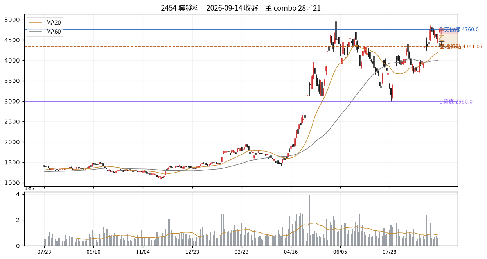

# 2454 聯發科　2026-09-14 收盤後

## 12 項指標
| # | 欄位 | 原值 | 同日分位 | 手冊線 |
|---|---|---|---|---|
| C01 | 壓縮 15d % | 26.32 | P92 | 2.5→P0；3.0→P1；3.5→P1 |
| C02 | 前高測試次數 | 2.00 | P77 | 3→P66；5→P79；6→P85 |
| C03 | 收盤品質 | 0.58 | P53 | 0.4→P50；0.7→P73；0.85→P84 |
| C04 | 洗盤破底深度 % | 缺值 | — |  |
| C05 | 突破量比 | 0.71 | P57 | 1.2→P64；1.5→P74；3.0→P91 |
| C06 | RS 超額（百分點） | 0.15 | P41 | 0.0→P52；2.0→P79 |
| C07 | 推進效率 ER | 0.22 | P59 | 0.15→P36；0.4→P81 |
| C08 | 250d 突破次數 | 7.00 | P92 | 1→P32；3→P55；4→P66 |
| C09 | 事件反應超額 | 缺值 | — |  |
| C10 | 三日 MAE %（T 時禁用） | 缺值 | — |  |
| C11 | 壓力修復根數（-1=未收復） | 2.00 | — |  |
| C12 | 距最近新高日數 | 5.00 | P4 | 15→P28；30→P38 |

## 關鍵價位
| 項目 | 值 |
|---|---|
| 收盤 | 4560.00 |
| 突破線 B | 4760.00 |
| 箱底 L | 2990.00 |
| 最近回檔低點 | 4341.07 |
| MA20 | 4187.25 |
| ATR(14) | 218.93 → 明日常態區 4341.07~4778.93 |

## 明日三分支
| 分支 | 條件 | 空手 | 持有 |
|---|---|---|---|
| 甲 | 收 > 4650.0（前一日高） | 掛突破買 @4654.65 | 續抱，停損上移至 @4341.07 |
| 乙 | 收 4341.07~4650.0 | 不動觀察 | 續抱，停損維持 @4187.25 |
| 丙 | 收 < 4341.07（收盤-1ATR） | 移出名單 | 出場或減半 @4341.07 |

**作廢條件**：開盤跳空超出 ±328.39 → 全部分支失效，當日重算

## 命中的 combo
### 28 快速修復但尚未突破　（E 類）— 修復完成
| 條件 | 實際值 | |
|---|---|---|
| `c11_bars_recover>=0` | c11_bars_recover=2.00 | ✓ |
| `c11_bars_recover<=T.recover_fast` | c11_bars_recover=2.00 | ✓ |
| `not below_L` | below_L=否 | ✓ |
| `not above_B` | above_B=否 | ✓ |

- 接著確認｜下一關是前高 B，而非反覆把已修復的長黑當利多
- 改判／失效｜跌回壓力日高點下方並失守最近回檔低點

### 21 跌得比較少、仍在跌　（D 類）— 抗跌待定
| 條件 | 實際值 | |
|---|---|---|
| `idx_ret<0` | idx_ret=-0.70 | ✓ |
| `ret<0` | ret=-0.55 | ✓ |
| `c06_rs>0` | c06_rs=0.15 | ✓ |
| `not above_B` | above_B=否 | ✓ |

- 接著確認｜能否止住低點下移並收復既定壓力
- 改判／失效｜再破低點延續走弱；收復壓力才更新方向

## 資料狀態
COMPLETE — 全部欄位可用

## 事件
無 event log 紀錄。F／I 類 combo 全部 UNAVAILABLE。

---
_本卡為狀態描述，無勝率估計。動作皆附價位；未附價位者代表定義未凍結，已略去。_