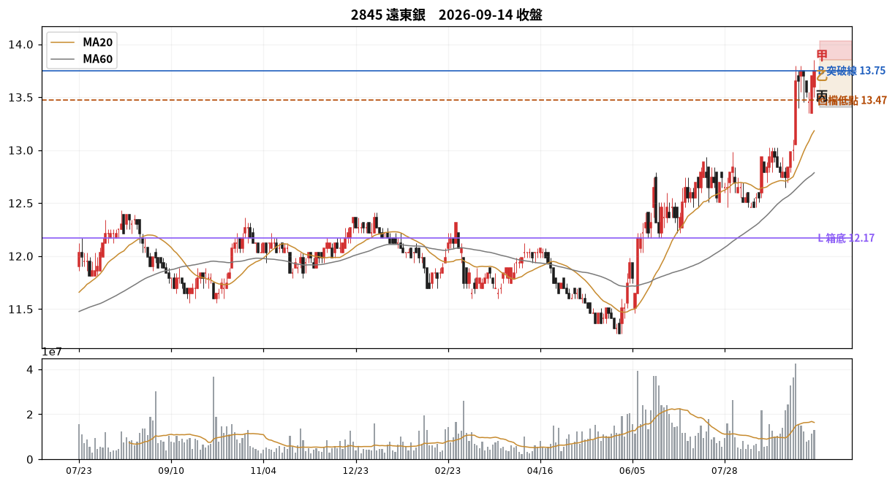

# 2845 遠東銀　2026-09-14 收盤後

## 12 項指標（欄名同速查手冊）
| # | 概念 | 手冊欄位 | 原值 | 同日分位 | 手冊線→實際百分位 |
|---|---|---|---|---|---|
| C01 | 壓縮整理 | `tightness_15d_pct` | 8.74 | P39 | 2.5→P0；3.0→P1；3.5→P1 |
| C02 | 阻力消耗 | `prior_high_tests_count` | 12.00 | P100 | 3→P66；5→P79；6→P85 |
| C03 | 突破推力 | `close_quality` | 0.71 | P67 | 0.4→P50；0.7→P73；0.85→P84 |
| C04 | 結構防守 | `shakeout_depth_pct` | 缺值 | — |  |
| C05 | 量價換手 | `high_zone_turnover_share_20d` ⛔停用 | 缺值 | — |  |
| C06 | 相對強弱 | `rs_excess_taiex_pct` | 1.06 | P72 | 0.0→P52；2.0→P79 |
| C07 | 推進效率 | `price_progress_efficiency_20d` | 0.38 | P83 | 0.15→P36；0.4→P81 |
| C08 | 趨勢年齡 | `major_breakout_count_250d` | 4.00 | P78 | 1→P32；3→P55；4→P66 |
| C09 | 資訊反應 | `resilience_excess_ret` ⛔需事件/T+3 | 缺值 | — |  |
| C10 | 事後認可 | `mfe_mae_ratio_3d` ⛔需事件/T+3 | 缺值 | — |  |
| C11 | 壓力修復 | `bars_to_recover_largest_down_day` | 7.00 | — |  |
| C12 | 動能老化 | `efficiency_decay` | -0.27 | — |  |

| 配套欄位 | 名稱 | 原值 | 同日分位 |
|---|---|---|---|
| C01 配套 | base_depth_pct | 18.63 | P18 |
| C05 配套 | 突破量比 | 0.78 | P64 |
| C05 配套 | 量縮比 | 0.65 | P25 |
| C06 配套 | 20 日 RS 超額 | 6.30 | P87 |
| C08 配套 | 自底漲幅 % | 22.01 | P54 |
| C12 配套 | 距最近新高日數 | 0.00 | P1 |

## 關鍵價位
| 項目 | 值 |
|---|---|
| 收盤 | 13.75 |
| 突破線 B | 13.75 |
| 箱底 L | 12.17 |
| 最近回檔低點 | 13.47 |
| MA20 | 13.18 |
| ATR(14) | 0.28 → 明日常態區 13.47~14.03 |

## 明日三分支
| 分支 | 條件 | 空手 | 持有 |
|---|---|---|---|
| 甲 | 收 > 13.85（前一日高） | 掛突破買 @13.86 | 續抱，停損上移至 @13.47 |
| 乙 | 收 13.47~13.85 | 不動觀察 | 續抱，停損維持 @13.18 |
| 丙 | 收 < 13.47（收盤-1ATR） | 移出名單 | 出場或減半 @13.47 |

**作廢條件**：開盤跳空超出 ±0.41 → 全部分支失效，當日重算

## 綜合判讀
目前沒有任何 combo 完全命中——這是有效結果，代表 65 組沒有描述到現在的狀態，不是偏空也不是偏多。照關鍵價位與三分支操作即可。

## 命中的 combo
_無完全命中。以下 PARTIAL 供參考。_

## 資料狀態
COMPLETE — 全部欄位可用

## 事件
無 event log 紀錄。F／I 類 combo 全部 UNAVAILABLE。

---
_本卡為狀態描述，無勝率估計。動作皆附價位；未附價位者代表定義未凍結，已略去。_