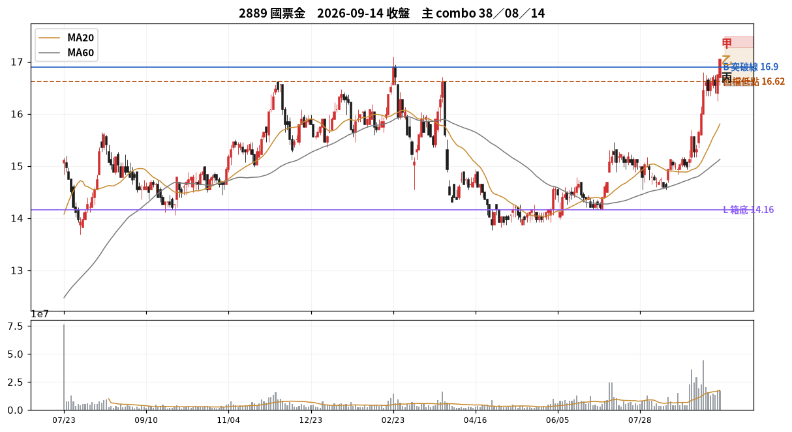

# 2889 國票金　2026-09-14 收盤後

## 12 項指標（欄名同速查手冊）
| # | 概念 | 手冊欄位 | 原值 | 同日分位 | 手冊線→實際百分位 |
|---|---|---|---|---|---|
| C01 | 壓縮整理 | `tightness_15d_pct` | 12.44 | P58 | 2.5→P0；3.0→P1；3.5→P1 |
| C02 | 阻力消耗 | `prior_high_tests_count` | 2.00 | P77 | 3→P66；5→P79；6→P85 |
| C03 | 突破推力 | `close_quality` | 1.00 | P94 | 0.4→P50；0.7→P73；0.85→P84 |
| C04 | 結構防守 | `shakeout_depth_pct` | 缺值 | — |  |
| C05 | 量價換手 | `high_zone_turnover_share_20d` ⛔停用 | 缺值 | — |  |
| C06 | 相對強弱 | `rs_excess_taiex_pct` | 2.49 | P90 | 0.0→P52；2.0→P79 |
| C07 | 推進效率 | `price_progress_efficiency_20d` | 0.55 | P95 | 0.15→P36；0.4→P81 |
| C08 | 趨勢年齡 | `major_breakout_count_250d` | 3.00 | P69 | 1→P32；3→P55；4→P66 |
| C09 | 資訊反應 | `resilience_excess_ret` ⛔需事件/T+3 | 缺值 | — |  |
| C10 | 事後認可 | `mfe_mae_ratio_3d` ⛔需事件/T+3 | 缺值 | — |  |
| C11 | 壓力修復 | `bars_to_recover_largest_down_day` | 2.00 | — |  |
| C12 | 動能老化 | `efficiency_decay` | -0.44 | — |  |

| 配套欄位 | 名稱 | 原值 | 同日分位 |
|---|---|---|---|
| C01 配套 | base_depth_pct | 19.19 | P20 |
| C05 配套 | 突破量比 | 1.02 | P78 |
| C05 配套 | 量縮比 | 0.86 | P49 |
| C06 配套 | 20 日 RS 超額 | 13.46 | P93 |
| C08 配套 | 自底漲幅 % | 23.75 | P56 |
| C12 配套 | 距最近新高日數 | 0.00 | P1 |

## 關鍵價位
| 項目 | 值 |
|---|---|
| 收盤 | 17.05 |
| 突破線 B | 16.90 |
| 箱底 L | 14.16 |
| 最近回檔低點 | 16.62 |
| MA20 | 15.81 |
| ATR(14) | 0.43 → 明日常態區 16.62~17.48 |

## 明日三分支
| 分支 | 條件 | 空手 | 持有 |
|---|---|---|---|
| 甲 | 收 > 17.27（收盤+0.5ATR） | 掛突破買 @17.29 | 續抱，停損上移至 @16.62 |
| 乙 | 收 16.62~17.27 | 不動觀察 | 續抱，停損維持 @15.81 |
| 丙 | 收 < 16.62（收盤-1ATR） | 移出名單 | 出場或減半 @16.62 |

**作廢條件**：開盤跳空超出 ±0.65 → 全部分支失效，當日重算

## 這個狀態之後，歷史上最常變成什麼
_主狀態 38 的 episode 結束後，下一段是什麼。2021 年起全市場統計，不是預測。_

| 下一個狀態 | 占比 |
|---|---|
| 28 快速修復但尚未突破 | 28.5% |
| 09 大量成交、收在低處 | 7.2% |
| 62 陰跌未破底 | 6.7% |

依方向彙總：多 50.6%、中性 30.4%、空 18.9%

## 綜合判讀
主狀態是 **38 盤中破線、收盤收回**（測試／待定）。

另有 2 組同時成立——注意手冊 combo 56 的提醒：收高、量大、RS 正這類欄位可能只是在重複描述同一天，不是幾張獨立選票。

下一步確認：後續收盤是否持續在線上並離開 B　／　失效條件：後續收盤跌回箱內且無法收回

## 命中的 combo
### 38 盤中破線、收盤收回　（G 類）— 測試／待定
| 條件 | 實際值 | |
|---|---|---|
| `above_B` | above_B=是 | ✓ |
| `low<B` | B=16.90、low=16.55 | ✓ |
| `not lower_lows` | lower_lows=否 | ✓ |

- 接著確認｜後續收盤是否持續在線上並離開 B
- 改判／失效｜後續收盤跌回箱內且無法收回

### 08 收得漂亮、量未放大　（B 類）— 確認不足
| 條件 | 實際值 | |
|---|---|---|
| `above_B` | above_B=是 | ✓ |
| `c03_cq>=T.cq_high` | c03_cq=1.00 | ✓ |
| `c05_volratio<T.vol_ratio_flat` | c05_volratio=1.02 | ✓ |

- 接著確認｜看是否在 B 上方形成穩定收盤，而非只等爆量
- 改判／失效｜重新收回箱內且 RS 轉弱

### 14 成熟趨勢仍順暢　（C 類）— 偏多延續
| 條件 | 實際值 | |
|---|---|---|
| `above_B` | above_B=是 | ✓ |
| `c08_bo_count>=2` | c08_bo_count=3.00 | ✓ |
| `c08_bo_count<=T.bo_count_mature_hi` | c08_bo_count=3.00 | ✓ |
| `c07_er>=T.er_high` | c07_er=0.55 | ✓ |
| `c07_net>0` | c07_net=2.02 | ✓ |
| `c06_rs>0` | c06_rs=2.49 | ✓ |

- 接著確認｜新的推進是否維持較高低點與相對領先
- 改判／失效｜推進轉為原地震盪且跌破最近回檔低點

## PARTIAL（有資料缺漏，不算不符）
| combo | 缺的條件 |
|---|---|
| 37 次日守線、三日回撤有限 | `c10_mae3<=T.mae3_ref` |
| 22 同時領先大盤與產業 | `c06_rs_ind>0` |
| 23 贏大盤但輸給產業 | `c06_rs_ind<0`；`ind_ret>0` |

## 資料狀態
COMPLETE — 全部欄位可用

## 事件
無 event log 紀錄。F／I 類 combo 全部 UNAVAILABLE。

---
_本卡為狀態描述，無勝率估計。動作皆附價位；未附價位者代表定義未凍結，已略去。_