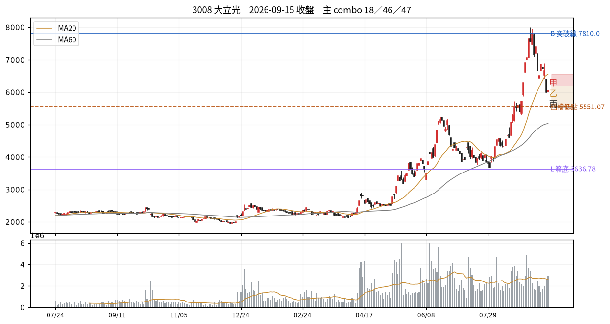

# 3008 大立光　2026-09-15 收盤後

## 12 項指標（欄名同速查手冊）
| # | 概念 | 手冊欄位 | 原值 | 同日分位 | 手冊線→實際百分位 |
|---|---|---|---|---|---|
| C01 | 壓縮整理 | `tightness_15d_pct` | 35.01 | — | 2.5→P0；3.0→P1；3.5→P1 |
| C02 | 阻力消耗 | `prior_high_tests_count` | 4.00 | — | 3→P66；5→P79；6→P85 |
| C03 | 突破推力 | `close_quality` | 0.47 | — | 0.4→P50；0.7→P73；0.85→P84 |
| C04 | 結構防守 | `shakeout_depth_pct` | 缺值 | — |  |
| C05 | 量價換手 | `high_zone_turnover_share_20d` ⛔停用 | 缺值 | — |  |
| C06 | 相對強弱 | `rs_excess_taiex_pct` | 1.77 | — | 0.0→P52；2.0→P79 |
| C07 | 推進效率 | `price_progress_efficiency_20d` | 0.12 | — | 0.15→P36；0.4→P81 |
| C08 | 趨勢年齡 | `major_breakout_count_250d` | 6.00 | — | 1→P32；3→P55；4→P66 |
| C09 | 資訊反應 | `resilience_excess_ret` ⛔需事件/T+3 | 缺值 | — |  |
| C10 | 事後認可 | `mfe_mae_ratio_3d` ⛔需事件/T+3 | 缺值 | — |  |
| C11 | 壓力修復 | `bars_to_recover_largest_down_day` | -1.00 | — |  |
| C12 | 動能老化 | `efficiency_decay` | 0.47 | — |  |

| 配套欄位 | 名稱 | 原值 | 同日分位 |
|---|---|---|---|
| C01 配套 | base_depth_pct | 73.54 | — |
| C05 配套 | 突破量比 | 1.11 | — |
| C05 配套 | 量縮比 | 0.82 | — |
| C06 配套 | 20 日 RS 超額 | 14.01 | — |
| C08 配套 | 自底漲幅 % | 209.08 | — |
| C12 配套 | 距最近新高日數 | 9.00 | — |

## 關鍵價位
| 項目 | 值 |
|---|---|
| 收盤 | 6055.00 |
| 突破線 B | 7810.00 |
| 箱底 L | 3636.78 |
| 最近回檔低點 | 5551.07 |
| MA20 | 6555.00 |
| ATR(14) | 503.93 → 明日常態區 5551.07~6558.93 |

## 明日三分支
| 分支 | 條件 | 空手 | 持有 |
|---|---|---|---|
| 甲 | 收 > 6195.0（前一日高） | 掛突破買 @6201.19 | 續抱，停損上移至 @5551.07 |
| 乙 | 收 5551.07~6195.0 | 不動觀察 | 續抱，停損維持 @6555.0 |
| 丙 | 收 < 5551.07（收盤-1ATR） | 移出名單 | 出場或減半 @5551.07 |

**作廢條件**：開盤跳空超出 ±755.89 → 全部分支失效，當日重算

## 這個狀態之後，歷史上最常變成什麼
_主狀態 18 的 episode 結束後，下一段是什麼。2021 年起全市場統計，不是預測。_

| 下一個狀態 | 占比 |
|---|---|
| 29 修復慢、反彈也落後 | 24.4% |
| 45 久未創高且同步落後 | 10.5% |
| 16 高齡加上推進受阻 | 9.9% |

依方向彙總：空 57.9%、中性 37.2%、多 4.9%

## 綜合判讀
主狀態是 **18 低效率但箱底穩定**（橫盤結構）。

另有 3 組同時成立——注意手冊 combo 56 的提醒：收高、量大、RS 正這類欄位可能只是在重複描述同一天，不是幾張獨立選票。

下一步確認：哪一側先以收盤突破，並檢查後續是否維持　／　失效條件：向上或向下離開箱體並獲後續確認

## 命中的 combo
### 18 低效率但箱底穩定　（C 類）— 橫盤結構
| 條件 | 實際值 | |
|---|---|---|
| `c07_er<=T.er_low` | c07_er=0.12 | ✓ |
| `not below_L` | below_L=否 | ✓ |
| `not shake_broken` | shake_broken=否 | ✓ |
| `abs(c06_rs)<T.rs_lead` | c06_rs=1.77 | ✓ |

- 接著確認｜哪一側先以收盤突破，並檢查後續是否維持
- 改判／失效｜向上或向下離開箱體並獲後續確認

### 46 效率衰退但價格續創高　（H 類）— 上行／效率降
| 條件 | 實際值 | |
|---|---|---|
| `c12_decay>0` | c12_decay=0.47 | ✓ |
| `c12_days_since_high<T.newhigh_gap_fast` | c12_days_since_high=9.00 | ✓ |
| `c06_rs>0` | c06_rs=1.77 | ✓ |

- 接著確認｜觀察高點擴張幅度與回檔低點
- 改判／失效｜結構低點失守且 RS 轉負

### 47 均線失守、低點尚未破　（H 類）— 局部轉弱
| 條件 | 實際值 | |
|---|---|---|
| `close<ma20` | close=6055.00、ma20=6555.00 | ✓ |
| `close>recent_swing_low` | close=6055.00、recent_swing_low=3636.78 | ✓ |
| `c06_rs>0` | c06_rs=1.77 | ✓ |

- 接著確認｜能否收復 MA20，或進一步跌破最近回檔低點
- 改判／失效｜收復且推進則改善；破低且 RS 轉負則轉弱擴大

### 64 擴張喇叭口　（K 類）— 波動擴張
| 條件 | 實際值 | |
|---|---|---|
| `lower_lows` | lower_lows=是 | ✓ |
| `higher_highs` | higher_highs=是 | ✓ |

- 接著確認｜哪一側先以收盤確立，並看波幅是否開始收斂
- 改判／失效｜重新形成同向的高低點序列

## 資料狀態
COMPLETE — 全部欄位可用

## 事件
無 event log 紀錄。F／I 類 combo 全部 UNAVAILABLE。

---
_本卡為狀態描述，無勝率估計。動作皆附價位；未附價位者代表定義未凍結，已略去。_