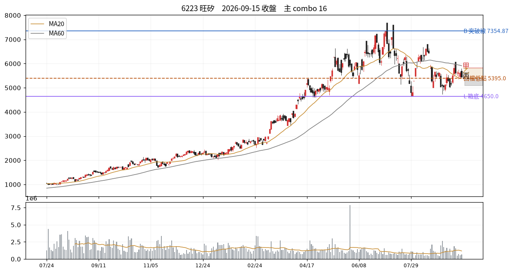

# 6223 旺矽　2026-09-15 收盤後

## 12 項指標（欄名同速查手冊）
| # | 概念 | 手冊欄位 | 原值 | 同日分位 | 手冊線→實際百分位 |
|---|---|---|---|---|---|
| C01 | 壓縮整理 | `tightness_15d_pct` | 24.45 | — | 2.5→P0；3.0→P1；3.5→P1 |
| C02 | 阻力消耗 | `prior_high_tests_count` | 2.00 | — | 3→P66；5→P79；6→P85 |
| C03 | 突破推力 | `close_quality` | 0.03 | — | 0.4→P50；0.7→P73；0.85→P84 |
| C04 | 結構防守 | `shakeout_depth_pct` | 缺值 | — |  |
| C05 | 量價換手 | `high_zone_turnover_share_20d` ⛔停用 | 缺值 | — |  |
| C06 | 相對強弱 | `rs_excess_taiex_pct` | -2.00 | — | 0.0→P52；2.0→P79 |
| C07 | 推進效率 | `price_progress_efficiency_20d` | 0.05 | — | 0.15→P36；0.4→P81 |
| C08 | 趨勢年齡 | `major_breakout_count_250d` | 14.00 | — | 1→P32；3→P55；4→P66 |
| C09 | 資訊反應 | `resilience_excess_ret` ⛔需事件/T+3 | 缺值 | — |  |
| C10 | 事後認可 | `mfe_mae_ratio_3d` ⛔需事件/T+3 | 缺值 | — |  |
| C11 | 壓力修復 | `bars_to_recover_largest_down_day` | 9.00 | — |  |
| C12 | 動能老化 | `efficiency_decay` | 0.16 | — |  |

| 配套欄位 | 名稱 | 原值 | 同日分位 |
|---|---|---|---|
| C01 配套 | base_depth_pct | 55.13 | — |
| C05 配套 | 突破量比 | 0.53 | — |
| C05 配套 | 量縮比 | 0.69 | — |
| C06 配套 | 20 日 RS 超額 | 2.78 | — |
| C08 配套 | 自底漲幅 % | 299.90 | — |
| C12 配套 | 距最近新高日數 | 51.00 | — |

## 關鍵價位
| 項目 | 值 |
|---|---|
| 收盤 | 5440.00 |
| 突破線 B | 7354.87 |
| 箱底 L | 4650.00 |
| 最近回檔低點 | 5395.00 |
| MA20 | 5395.00 |
| ATR(14) | 355.36 → 明日常態區 5084.64~5795.36 |

## 明日三分支
| 分支 | 條件 | 空手 | 持有 |
|---|---|---|---|
| 甲 | 收 > 5800.0（前一日高） | 掛突破買 @5805.8 | 續抱，停損上移至 @5395.0 |
| 乙 | 收 5395.0~5800.0 | 不動觀察 | 續抱，停損維持 @5395.0 |
| 丙 | 收 < 5395.0（MA20） | 移出名單 | 出場或減半 @5395.0 |

**作廢條件**：開盤跳空超出 ±533.04 → 全部分支失效，當日重算

## 這個狀態之後，歷史上最常變成什麼
_主狀態 16 的 episode 結束後，下一段是什麼。2021 年起全市場統計，不是預測。_

| 下一個狀態 | 占比 |
|---|---|
| 18 低效率但箱底穩定 | 44.7% |
| 47 均線失守、低點尚未破 | 5.8% |
| 46 效率衰退但價格續創高 | 5.7% |

依方向彙總：中性 66.1%、空 20.3%、多 13.5%

## 綜合判讀
主狀態是 **16 高齡加上推進受阻**（轉弱疑慮）。

下一步確認：最近支撐是否失守，反彈能否重新領先大盤　／　失效條件：重新向上推進、效率改善且 RS 回正

## 命中的 combo
### 16 高齡加上推進受阻　（C 類）— 轉弱疑慮
| 條件 | 實際值 | |
|---|---|---|
| `(c08_bo_count>=T.bo_count_aged) or (c08_gain_from_low>T.gain_from_low_aged)` | c08_bo_count=14.00、c08_gain_from_low=299.90 | ✓ |
| `c07_er<=T.er_low` | c07_er=0.05 | ✓ |
| `c06_rs<0` | c06_rs=-2.00 | ✓ |

- 接著確認｜最近支撐是否失守，反彈能否重新領先大盤
- 改判／失效｜重新向上推進、效率改善且 RS 回正

## 資料狀態
COMPLETE — 全部欄位可用

## 事件
無 event log 紀錄。F／I 類 combo 全部 UNAVAILABLE。

---
_本卡為狀態描述，無勝率估計。動作皆附價位；未附價位者代表定義未凍結，已略去。_