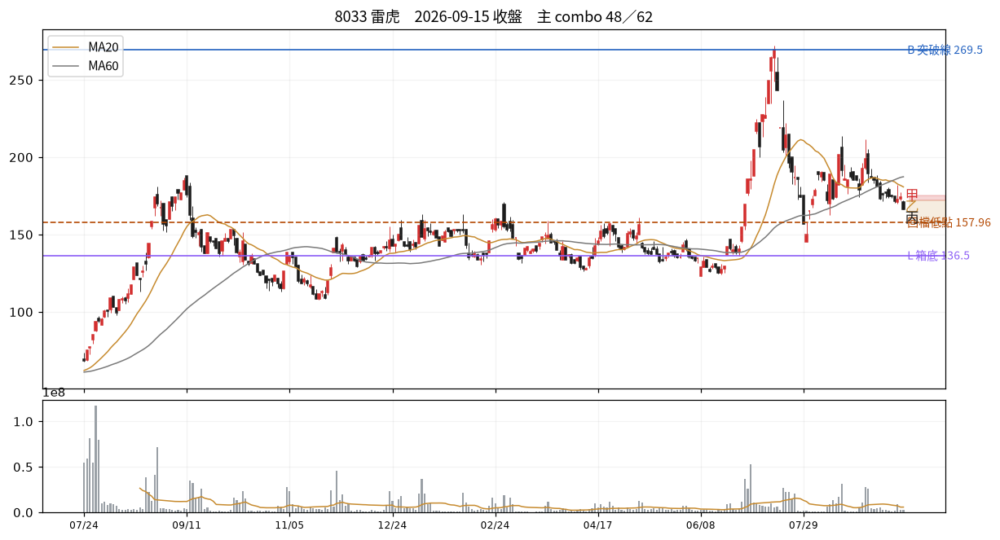

# 8033 雷虎　2026-09-15 收盤後

## 12 項指標（欄名同速查手冊）
| # | 概念 | 手冊欄位 | 原值 | 同日分位 | 手冊線→實際百分位 |
|---|---|---|---|---|---|
| C01 | 壓縮整理 | `tightness_15d_pct` | 27.03 | — | 2.5→P0；3.0→P1；3.5→P1 |
| C02 | 阻力消耗 | `prior_high_tests_count` | 3.00 | — | 3→P66；5→P79；6→P85 |
| C03 | 突破推力 | `close_quality` | 0.00 | — | 0.4→P50；0.7→P73；0.85→P84 |
| C04 | 結構防守 | `shakeout_depth_pct` | 缺值 | — |  |
| C05 | 量價換手 | `high_zone_turnover_share_20d` ⛔停用 | 缺值 | — |  |
| C06 | 相對強弱 | `rs_excess_taiex_pct` | -3.54 | — | 0.0→P52；2.0→P79 |
| C07 | 推進效率 | `price_progress_efficiency_20d` | 0.25 | — | 0.15→P36；0.4→P81 |
| C08 | 趨勢年齡 | `major_breakout_count_250d` | 2.00 | — | 1→P32；3→P55；4→P66 |
| C09 | 資訊反應 | `resilience_excess_ret` ⛔需事件/T+3 | 缺值 | — |  |
| C10 | 事後認可 | `mfe_mae_ratio_3d` ⛔需事件/T+3 | 缺值 | — |  |
| C11 | 壓力修復 | `bars_to_recover_largest_down_day` | -1.00 | — |  |
| C12 | 動能老化 | `efficiency_decay` | -0.40 | — |  |

| 配套欄位 | 名稱 | 原值 | 同日分位 |
|---|---|---|---|
| C01 配套 | base_depth_pct | 54.78 | — |
| C05 配套 | 突破量比 | 0.42 | — |
| C05 配套 | 量縮比 | 0.60 | — |
| C06 配套 | 20 日 RS 超額 | -10.93 | — |
| C08 配套 | 自底漲幅 % | 54.63 | — |
| C12 配套 | 距最近新高日數 | 44.00 | — |

## 關鍵價位
| 項目 | 值 |
|---|---|
| 收盤 | 166.50 |
| 突破線 B | 269.50 |
| 箱底 L | 136.50 |
| 最近回檔低點 | 157.96 |
| MA20 | 180.80 |
| ATR(14) | 8.54 → 明日常態區 157.96~175.04 |

## 明日三分支
| 分支 | 條件 | 空手 | 持有 |
|---|---|---|---|
| 甲 | 收 > 172.0（前一日高） | 掛突破買 @172.17 | 續抱，停損上移至 @157.96 |
| 乙 | 收 157.96~172.0 | 不動觀察 | 續抱，停損維持 @180.8 |
| 丙 | 收 < 157.96（收盤-1ATR） | 移出名單 | 出場或減半 @157.96 |

**作廢條件**：開盤跳空超出 ±12.80 → 全部分支失效，當日重算

## 這個狀態之後，歷史上最常變成什麼
_主狀態 48 的 episode 結束後，下一段是什麼。2021 年起全市場統計，不是預測。_

| 下一個狀態 | 占比 |
|---|---|
| 18 低效率但箱底穩定 | 15.6% |
| 27 跌破未收、相對也弱 | 15.5% |
| 21 跌得比較少、仍在跌 | 15.0% |

依方向彙總：中性 52.4%、空 46.5%、多 1.2%

## 綜合判讀
主狀態是 **48 動能、低點、相對同步轉差**（偏空結構）。

下一步確認：修復是否先收回失守低點，再恢復較高低點　／　失效條件：完成收復並重新形成向上高低點

## 命中的 combo
### 48 動能、低點、相對同步轉差　（H 類）— 偏空結構
| 條件 | 實際值 | |
|---|---|---|
| `c12_days_since_high>T.newhigh_gap_mid` | c12_days_since_high=44.00 | ✓ |
| `close<recent_swing_low` | close=166.50、recent_swing_low=174.00 | ✓ |
| `c06_rs<0` | c06_rs=-3.54 | ✓ |
| `c11_bars_recover<0` | c11_bars_recover=-1.00 | ✓ |

- 接著確認｜修復是否先收回失守低點，再恢復較高低點
- 改判／失效｜完成收復並重新形成向上高低點

### 62 陰跌未破底　（K 類）— 偏空但結構未破
| 條件 | 實際值 | |
|---|---|---|
| `c03_cq<T.cq_weak` | c03_cq=0.00 | ✓ |
| `c06_rs<0` | c06_rs=-3.54 | ✓ |
| `c11_bars_recover<0` | c11_bars_recover=-1.00 | ✓ |
| `not below_L` | below_L=否 | ✓ |

- 接著確認｜箱底守不守得住；收盤品質能否回到中段以上
- 改判／失效｜收盤品質回升且 RS 轉正

## 資料狀態
COMPLETE — 全部欄位可用

## 事件
無 event log 紀錄。F／I 類 combo 全部 UNAVAILABLE。

---
_本卡為狀態描述，無勝率估計。動作皆附價位；未附價位者代表定義未凍結，已略去。_